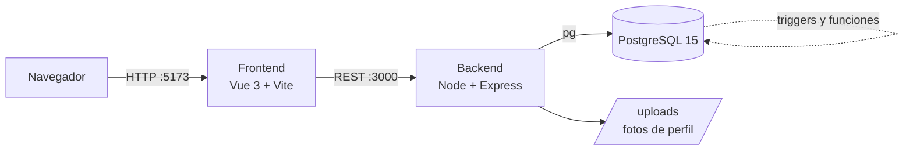

<div align="center">

# 🚀 ApexDev — Sistema de Gestión de Proyectos Empresariales

**Plataforma web para administrar proyectos, tareas, equipos, clientes, recursos y reportes en una empresa de desarrollo.**


</div>

---

## 📑 Tabla de contenidos

- [Características](#-características)
- [Stack tecnológico](#-stack-tecnológico)
- [Arquitectura](#-arquitectura)
- [Estructura del proyecto](#-estructura-del-proyecto)
- [Inicio rápido](#-inicio-rápido)
- [Variables de entorno](#-variables-de-entorno)
- [Instalación manual (sin Docker)](#-instalación-manual-sin-docker)
- [Roles y módulos](#-roles-y-módulos)
- [API REST](#-api-rest)
- [Base de datos](#-base-de-datos)
- [Solución de problemas](#-solución-de-problemas)
- [Roadmap](#-roadmap)

---

## ✨ Características

- 👥 **Tres roles** (`admin`, `gerente`, `empleado`) con dashboard propio para cada uno.
- 📁 **Gestión de proyectos**: creación, estados, presupuesto, cronograma y clientes asociados.
- ✅ **Tablero de tareas** con dependencias, comentarios e historial de cambios de estado.
- 🧑‍🤝‍🧑 **Asignación de equipos** con control automático de sobreasignación de horas.
- 🧰 **Inventario de recursos materiales** asociados a proyectos.
- 📊 **Reportes** de costos, avance, cronograma y nómina, con **exportación a PDF y Excel**.
- 🔔 **Alertas automáticas** (presupuesto excedido, tareas retrasadas, nuevas asignaciones).
- 👤 **Perfil de usuario** con cambio de contraseña y foto.

---

## 🛠 Stack tecnológico

| Capa | Tecnología |
|---|---|
| **Frontend** | Vue 3, Vue Router 4, Vite 8, Chart.js |
| **Exportación** | jsPDF, jsPDF-AutoTable, SheetJS (`xlsx`) |
| **Backend** | Node.js 18, Express 4, Multer, dotenv, cors, bcrypt |
| **Base de datos** | PostgreSQL 15 (funciones, procedimientos, vistas y triggers PL/pgSQL) |
| **Infraestructura** | Docker y Docker Compose |
| **Desarrollo** | nodemon (hot reload en backend), Vite HMR (frontend) |

---

## 🏗 Arquitectura



La lógica de negocio pesada (dashboards, reportes, alertas, auditoría) vive en la base de datos como funciones y triggers; la API se encarga de exponerla.

---

## 📂 Estructura del proyecto

```
.
├── docker-compose.yml          # Orquesta db + backend + frontend
├── .env.example                # Plantilla de variables de entorno
├── README.md
│
├── backend/                    # API REST
│   ├── Dockerfile
│   ├── package.json
│   ├── server.js               # Punto de entrada
│   ├── config/
│   │   ├── db.js               # Pool de conexión a PostgreSQL
│   │   ├── 01_init.sql         # Esquema + datos semilla
│   │   └── 02_procesos.sql     # Funciones, SPs, vistas y triggers
│   ├── controllers/            # Lógica por módulo
│   ├── routes/                 # Endpoints por módulo
│   └── uploads/                # Fotos de perfil
│
└── frontend/                   # SPA
    ├── Dockerfile
    ├── package.json
    ├── vite.config.js
    └── src/
        ├── main.js
        ├── App.vue
        ├── router/             # Rutas y guardas de sesión
        ├── components/         # Sidebar, Topbar
        ├── assets/css/
        └── views/              # Una vista por módulo
```

---

## ⚡ Inicio rápido

### Requisitos

- [Docker](https://docs.docker.com/get-docker/) 20+ con Docker Compose v2
- [Git](https://git-scm.com/)

### Pasos

```bash
# 1. Clonar el repositorio
git clone https://github.com/<tu-usuario>/<tu-repo>.git
cd <tu-repo>

# 2. Levantar todos los servicios
docker compose up -d --build
```

Cuando termine:

| Servicio | URL |
|---|---|
| 🖥 Frontend | http://localhost:5173 |
| ⚙️ API | http://localhost:3000 |
| 🩺 Health check (API + BD) | http://localhost:3000/api/test-db |
| 🐘 PostgreSQL | `localhost:5432` |

En el primer arranque, PostgreSQL ejecuta automáticamente `01_init.sql` y `02_procesos.sql`, que crean el esquema, los datos de ejemplo y los triggers.

### Comandos útiles

```bash
docker compose logs -f backend     # Logs del backend
docker compose restart backend     # Reiniciar un servicio
docker compose down                # Detener (conserva los datos)
docker compose down -v             # Detener y borrar la base de datos
docker exec -it apexdev_db psql -U admin -d gestion_proyectos   # Consola SQL
```

> ⚠️ Los scripts SQL solo se ejecutan si el volumen `pgdata` está vacío. Si los modificás, recreá la base con `docker compose down -v && docker compose up -d --build`.

---

## 🔐 Variables de entorno

Copiá la plantilla y ajustá los valores:

```bash
cp .env.example backend/.env
```

```env
PORT=3000

DB_USER=admin
DB_PASSWORD=adminpassword
DB_HOST=db              # "db" con Docker | "localhost" sin Docker
DB_PORT=5432
DB_NAME=gestion_proyectos
```

| Variable | Descripción | Default |
|---|---|---|
| `PORT` | Puerto de la API | `3000` |
| `DB_USER` | Usuario de PostgreSQL | `admin` |
| `DB_PASSWORD` | Contraseña de PostgreSQL | `adminpassword` |
| `DB_HOST` | Host de la BD (`db` = servicio de Docker) | `db` |
| `DB_PORT` | Puerto de PostgreSQL | `5432` |
| `DB_NAME` | Nombre de la base de datos | `gestion_proyectos` |

> Con Docker, el `docker-compose.yml` ya inyecta estas variables al backend; el `.env` es necesario solo al correr sin Docker.
> ⚠️ **Cambiá las credenciales por defecto** antes de desplegar en cualquier entorno real.

---

## 🧑‍💻 Instalación manual (sin Docker)

**Requisitos:** Node.js 22.12+ (Vite 8), PostgreSQL 15, npm.

```bash
# 1. Base de datos
createdb -U postgres gestion_proyectos
psql -U postgres -d gestion_proyectos -f backend/config/01_init.sql
psql -U postgres -d gestion_proyectos -f backend/config/02_procesos.sql

# 2. Backend
cd backend
cp ../.env.example .env        # cambiar DB_HOST=localhost
npm install
npm run dev

# 3. Frontend (otra terminal)
cd frontend
npm install
npm run dev
```

---

## 👥 Roles y módulos

| Ruta | Módulo | Descripción |
|---|---|---|
| `/login` | Login | Inicio de sesión |
| `/` | Dashboard | Panel según el rol |
| `/proyectos` | Proyectos | Gestión de proyectos |
| `/empleados` | Empleados | Directorio de RR. HH. |
| `/clientes` | Clientes | Directorio de clientes |
| `/recursos` | Recursos | Inventario de recursos materiales |
| `/reportes` | Reportes | Costos, avance, nómina; export PDF/Excel |
| `/equipo` | Equipo | Asignación de miembros y tareas |
| `/tareas` | Tareas | Tablero y comentarios |
| `/registrar-horas` | Registrar horas | Registro de avance |
| `/registros` | Registros | Historial |
| `/alertas` | Alertas | Notificaciones |
| `/perfil` | Perfil | Datos, contraseña y foto |

**Usuarios de ejemplo:** los datos semilla de `backend/config/01_init.sql` incluyen un usuario por cada rol (admin, gerente y empleado) para probar la aplicación.

---

## 🔌 API REST

Base URL: `http://localhost:3000/api`

| Recurso | Ruta base | Operaciones principales |
|---|---|---|
| Auth | `/login` | `POST /login` |
| Dashboard | `/dashboard` | `GET /admin`, `/gerente/:id`, `/empleado/:id` |
| Proyectos | `/proyectos` | CRUD, `PUT /:id/estado`, `/utilidades/*` |
| Equipo | `/equipo` | Miembros y tareas por proyecto |
| Tareas | `/tareas` | `GET /tablero/:id_proyecto`, `PATCH /:id_tarea/estado`, comentarios |
| Avances | `/avances` | Registro de avance |
| Clientes | `/clientes` | CRUD |
| Empleados | `/empleados` | CRUD |
| Recursos | `/recursos` | CRUD y recursos por proyecto |
| Reportes | `/reportes` | `/costos`, `/avance`, `/financiero-view`, `/cronograma-view`, `/nomina` |
| Alertas | `/alertas` | `GET /usuario/:id`, `PATCH /usuario/:id/leer` |
| Registros | `/registros` | Historial de horas |
| Usuario | `/usuario` | `GET /perfil/:id`, `PUT /perfil`, `PUT /password`, `POST /upload-foto` |

---

## 🗄 Base de datos

**Tablas:** `USUARIO`, `CLIENTE`, `RECURSO_MATERIAL`, `PROYECTO`, `TAREA`, `ES_MIEMBRO`, `DEPENDE`, `REGISTRO_AVANCE`, `UTILIZA`, `COMENTARIO`, `NOTIFICACION`, `HISTORIAL_ESTADO`.

**Lógica en la BD:**

- **Funciones:** dashboards por rol, listado de proyectos y equipo, reportes de costos, avance y nómina.
- **Procedimiento:** `sp_crear_proyecto`.
- **Vistas:** `vw_reporte_financiero`, `vw_reporte_cronograma_tareas`.
- **Triggers:** sincronización de avance, auditoría de estados, alerta de presupuesto, alerta de retraso, control de sobreasignación y notificación de asignaciones.

---

## 🩹 Solución de problemas

| Problema | Solución |
|---|---|
| `Error de conexión a la BD` al iniciar | Postgres aún está arrancando; esperá unos segundos o `docker compose restart backend`. |
| Cambié el SQL y no se refleja | `docker compose down -v && docker compose up -d --build`. |
| Puerto 3000, 5173 o 5432 ocupado | Liberá el puerto o cambiá el mapeo en `docker-compose.yml`. |
| Error con `bcrypt` en local | `rm -rf node_modules && npm install`. |
| El frontend no recarga en Docker | Verificá el volumen `./frontend:/app` (ya hay `usePolling` en `vite.config.js`). |

---

## 🗺 Roadmap

- [ ] Autenticación con JWT y hash de contraseñas con `bcrypt`
- [ ] Middleware de autorización por rol en la API
- [ ] Configurar la URL de la API con `VITE_API_URL`
- [ ] Imágenes Docker de producción (`vite build` + Nginx)
- [ ] Restringir CORS
- [ ] Tests automatizados

---

<div align="center">

Hecho con ❤️ como proyecto académico · **ApexDev**

</div>